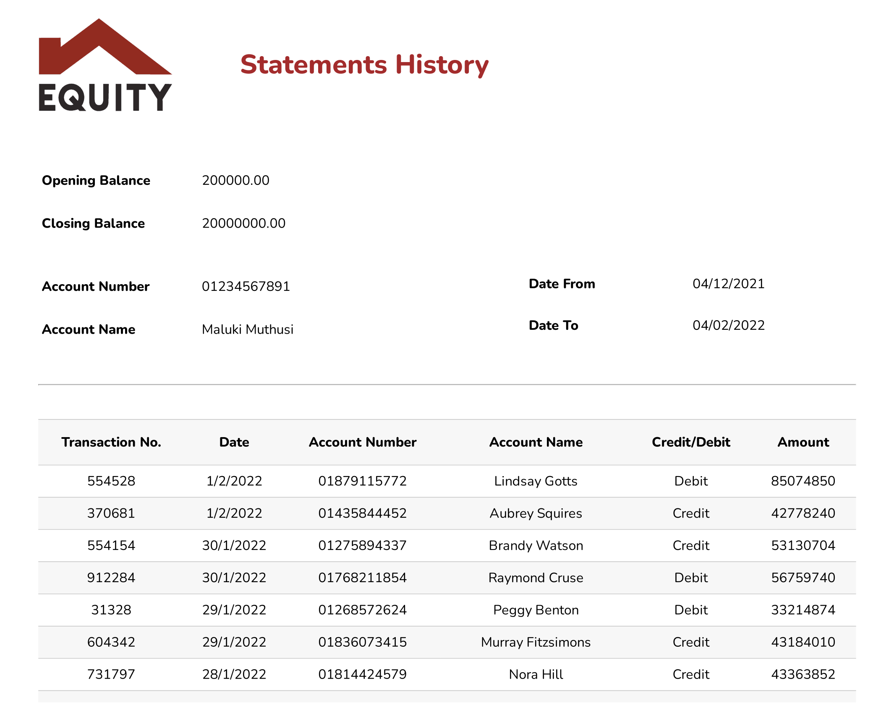
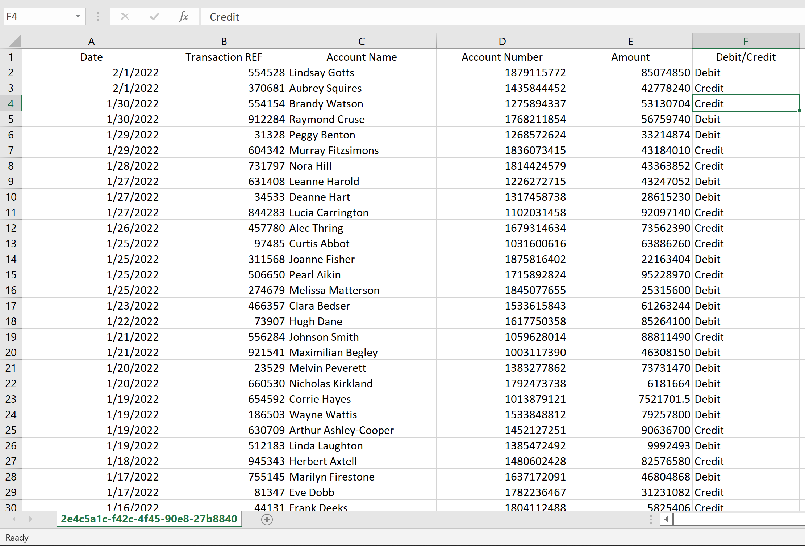
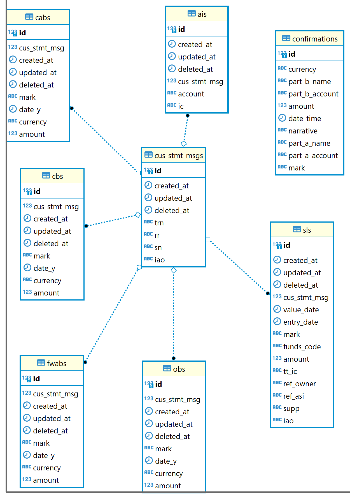
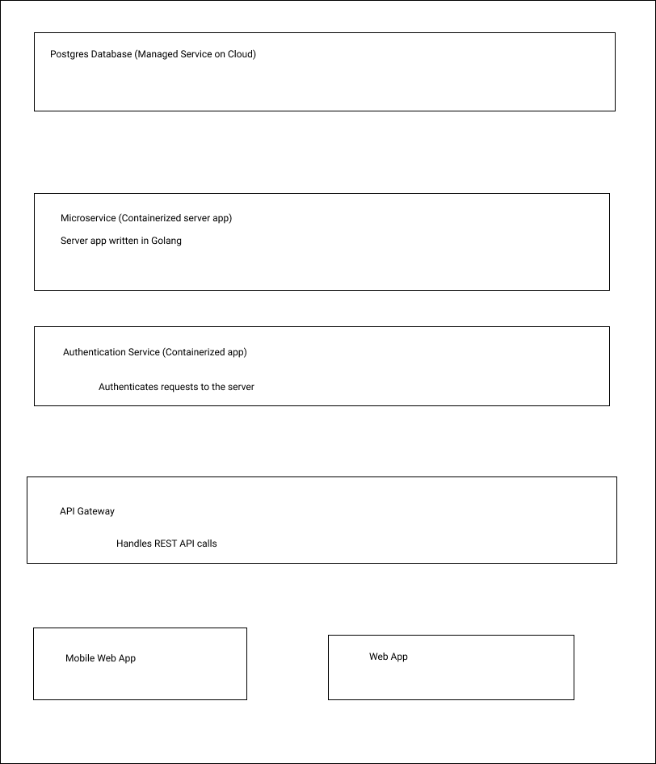

# Team Ratula

## Members

Maluki Muthusi Maluki [malukimuthusi@gmail.com](malukimuthusi@gmail.com)

FrankLine Bosire [frankbosire2017@gmail.com](frankbosire2017@gmail.com)

Some Important Links

- Our app is at [https://equity.riviatechs.com](https://equity.riviatechs.com)
- Our API server is at [https://server.equity.riviatechs.com](https://server.equity.riviatechs.com)

## Solution Statement

### Problem Statement II, Configurable MT940 Statements

We decided to handle challenge II, after reviewing all of the provided challenges. We believe we have insights to build a unique solution for the challenge.

We phrased the problem and came up with a design that addresses the main objectives.

### Objectives

- Develop a configurable widget to download MT940s in various formats e.g xls, pdf, or free formats that allows section and formatting of columns(column layout, content, etc)

- A widget which we would then consume from within equity platform via API calls.

- Provide a daily overview of all movements in a company's account(s)

- Allows business to know their financial position for timely descisions, which supports effective liquidity management. Therefore, this is important in supporting cash forecasting

- Users to be able to select the columns and layout from the raw format via a simple UI

- Easily download the selected MT940 data and corresponding columns in various file types

### Justification of Solution

- Through our solution equity bank users will be able to get statements of their transactions in the various way they want.

- They can select what they want to be included in the statements reports and also be capable of filtering the statements to what their want.

- It makes it easy to keep track of their financial transactions.

- By offering users to select what they want, it helps to keep the customers happy, and keep using the banks online.

### Detailed Description of the solution

#### Features

Users can select to include or not any include the following fields:-

- Date of the transaction
- Transaction Reference number
- Transaction type credit/debit
- Account Number in which money was debited or credited to
- Account Name of the account in which money was credited or debited from
- Amount that was credited or debited
- Narrative, which explains the transaction was about, for example reversal, pay electricity bill e.t.c

Users can select to filter the transactions with combinations of the following criteria

- Amount Range, specify to get transaction with certain range
- Exact Amount, Specify to get transactions that equal a given amount
- Period, Specify to get transactions that happened during a particular period
- Credit/Debit, Specify to get transactions of the type money in or money out to your account, or get both type of transactions
- Currency, specify transactions of a particular currency
- Download, Specify to download the transactions and get a file format of either pdf, csv or xls

##### Example of a pdf report generated by the user

##### Example of a CSV/XLS report generated by the user

### Benefits

- Improve on customer experience with the product.
- This solution can be used with Equity's various products, like mobiles apps, web apps and even USSD
- This solution helps to support users with low bandwidth, by sending only the exact data the users want
- Corporate users can use this feature to confirm their transactions up to nuisance granularity
- This feature helps to implement other features that can be different to implement when using a different architecture

### Assumptions

We assume users already have equity bank accounts.

### Conclusion

## Technical Documentation

### API Level

At the very high level, we have build an API that offers flexibility in what you want.

For example, you want to view all the transaction that happened between 01/01/2019 to 02/02/2020 and for those transactions, you only want those that were of type credit to your account. You also want to get only the date and Amount and dowload that data in excel format or a pdf report.

Our query system supports those kind of use cases and other complicated ones.

We have been able to achieve these through the use of data graph solution. We have build our API schema using [graphql](https://graphql.org), an open source query language.

User can download pdf or csv or xls document of the fields that they have indicated they want, with filters they have specified.

### Low level

We have a parser that we can use to receive MT900 (Confirmation of Debit) and MT910 (Confirmation of Credit) and MT940 (Customer Statement Message).

We then parse that data and save it into our database

### ERD

### Architecture

#### Programming Languages

- The mobile and web app is built using React. In particular we are using [https://nextjs.org](https://nextjs.org), because it offers server side rendering (SSR) and Client Side Rendering (CSR)

- The API server is build using Golang [https://go.dev](https://go.dev)

- For authentication we have deployed our own Single Sign On (SSO) service, using and open source solution [https://casdoor.org](https://casdoor.org)

- We have built our API using graphql query language. Graphql is an open source solution that uses REST APIs.

- We are using docker to containerize our applications so that they can be deployed on any cloud service provider.

- We have deployed our containers to Cloud Run, equivalent to AZURE Container Instances.

- We are using continuos deployment of our code. Each git pull triggers a new build of the code. If the build is successful the code is deployed to the staging environment.

- We test the app on our devices and then trigger a build to our production environment.

- We have used postgres for storage of data.

- We are using a loosely coupled architecture and each layer can be scaled independently to meet the number of requests.

## Solution Access

Link to our app [https://equity.riviatechs.com](https://equity.riviatechs.com)
