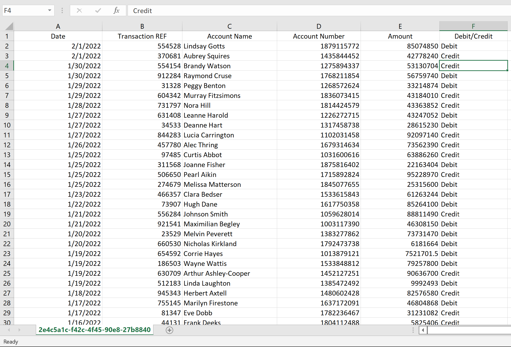

# Team Rutela

## Members

Maluki Muthusi Maluki [malukimuthusi@gmail.com](malukimuthusi@gmail.com)

FrankLine Bosire [frankbosire2017@gmail.com](frankbosire2017@gmail.com)

Some Important Links

- Our app is at [https://equity.riviatechs.com](https://equity.riviatechs.com)
- Our API server is at [https://mt940-server-s47opgtmgq-uc.a.run.app](https://mt940-server-s47opgtmgq-uc.a.run.app) The domain name will be  [https://server.equity.riviatechs.com](https://equity.riviatechs.com)

- Server code is at [https://github.com/riviatechs/mt940_server](https://github.com/riviatechs/mt940_server)
- App code is at [https://github.com/riviatechs/Adjustable-Widget-Equity-Hackathon](https://github.com/riviatechs/Adjustable-Widget-Equity-Hackathon)

- Link to this report [https://github.com/riviatechs/equity-report](https://github.com/riviatechs/equity-report)

## Background Information

Many Corporates receive a lot of daily transactions through their accounts. The people managing those accounts find themselves many times trying to search the transactions to find certain transactions when need arises.

Sending the normal MT940 statements to these clients, does not fulfill their special use cases.

They want to get an updated view of their transactions at any time. They might choose ask for some specific data in the history of their transactions.

## Problem Statement II, Configurable MT940 Statements

MT940 format is an electronic bank statement file used by the SWIFT network to send and receive end-of-day bank account statements and transactions reporting.

The bank can send MT940 statements to its users for the transactions that have happened.

The bank wants to have a way to send only statements that are of interest and relevance to the users.

## Objectives

1. Develop a configurable widget to download MT940s in various formats e.g xls, pdf, or free formats that allows selection and formatting of columns(column layout, content, etc)

2. A widget which the bank would then consume from within equity platform via API calls.

3. Users to be able to select the columns and layout from the raw format via a simple UI

4. Easily download the selected MT940 data and corresponding columns in various file types

## Justification of Solution

1. The solution will offer flexibility to the users when requesting data from the bank

2. Through our solution equity bank users will be able to get statements of their transactions in the formats they want.

3. They can select what they want to be included in the statements reports and also be capable of filtering the statements to what their want.

4. It makes it easy to keep track of their financial transactions.

5. By offering users to select what they want, it helps to keep the customers happy, and keep using the banks online.

6. Our solution has the look and feel of the Equity products and it is easy to integrate with it.

## Benefits

1. Improve on customer experience with the product.
2. This solution can be used with Equity's various products, like mobiles apps, web apps and even USSD
3. This solution helps to support users with low bandwidth, by sending only the exact data the users want
4. Corporate users can use this feature to confirm their transactions up to nuisance granularity
5. This feature helps to implement other features that can be different to implement when using a different architecture

## Detailed Description of the solution

We have developed a configurable widget that can support  user queries up to the very detailed granularity of what they want.

At the core of our widget is a query schema, which have built using open source technologies, Golang and Graphql.

Users can select to include or not any include the following fields:-

1. Date of the transaction
2. Transaction Reference number
3. Transaction type credit/debit
4. Account Number in which money was debited or credited to
5. Account Name of the account in which money was credited or debited from
6. Amount that was credited or debited
7. Narrative, which explains the transaction was about, for example reversal, pay electricity bill e.t.c

Users can select to filter the transactions with combinations of the following criteria

1. Amount Range, specify to get transaction with certain range
2. Exact Amount, Specify to get transactions that equal a given amount
3. Period, Specify to get transactions that happened during a particular period
4. Credit/Debit, Specify to get transactions of the type money in or money out to your account, or get both type of transactions
5. Currency, specify transactions of a particular currency
6. Download, Specify to download the transactions and get a file format of either pdf, csv or xls

### Example of a pdf report generated by the user

### Example of a CSV/XLS report generated by the user

## Assumptions and Limitations

1. We assumed users already have equity bank accounts and they are authenticated through Equity's authentication schemes.

2. We are using test data to simulate a corporate account that receives a lot of transactions.

## Conclusion

We have designed and implemented a solution that caters for the requested needs

1. We have implemented a  system that enables users to select the fields they want and apply filters of their choice and request to download the data in various formats for their needs. This meets objective 1 of the problem.

2. We have provided an API which the bank can consume in its various products, mobile apps, web apps, USSD e.t.c. We have built the API using open standards, REST and Graphql.

3. Through the system users can select the fields they want and apply filters to view specif data.

4. Our solution offers a means to easily download data various formats, PDF/CSV and XLS.
