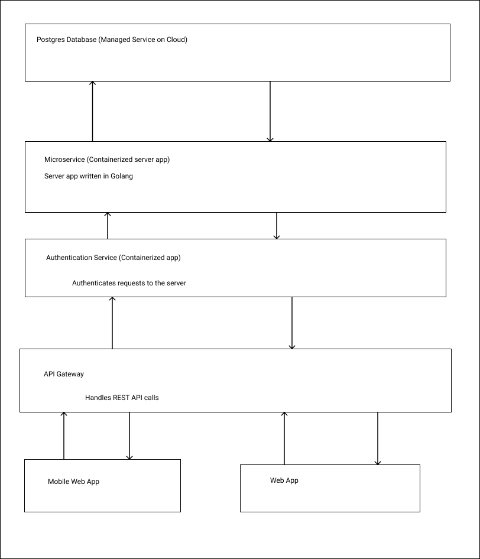

# Technical Documentation

## Members

Maluki Muthusi Maluki [malukimuthusi@gmail.com](malukimuthusi@gmail.com)

FrankLine Bosire [frankbosire2017@gmail.com](frankbosire2017@gmail.com)

Some Important Links

- Our app is at [https://equity.riviatechs.com](https://equity.riviatechs.com)
- Our API server is at [https://mt940-server-s47opgtmgq-uc.a.run.app](https://mt940-server-s47opgtmgq-uc.a.run.app) The domain name will be  [https://server.equity.riviatechs.com](https://equity.riviatechs.com)

- Server code is at [https://github.com/riviatechs/mt940_server](https://github.com/riviatechs/mt940_server)
- App code is at [https://github.com/riviatechs/Adjustable-Widget-Equity-Hackathon](https://github.com/riviatechs/Adjustable-Widget-Equity-Hackathon)

- Link to this report [https://github.com/riviatechs/equity-report](https://github.com/riviatechs/equity-report)

## API Level

At the very high level, we have build an API that offers flexibility in what you want.

For example, you want to view all the transaction that happened between 01/01/2019 to 02/02/2020 and for those transactions, you only want those that were of type credit to your account. You also want to get only the date and Amount and dowload that data in excel format or a pdf report.

Our query system supports those kind of use cases and other complicated ones.

We have been able to achieve these through the use of data graph solution. We have build our API schema using [graphql](https://graphql.org), an open source query language.

User can download pdf or csv or xls document of the fields that they have indicated they want, with filters they have specified.

## Low level

We have a parser that we can use to receive MT900 (Confirmation of Debit) and MT910 (Confirmation of Credit) and MT940 (Customer Statement Message).

We then parse that data and save it into our database

## ERD

## Architecture

### Programming Languages and Tools

- The mobile and web app is built using ReactJS. In particular we are using [https://nextjs.org](https://nextjs.org), because it offers server side rendering (SSR) and Client Side Rendering (CSR)

- The API server is build using Golang [https://go.dev](https://go.dev)

- For authentication we have deployed our own Single Sign On (SSO) service, using and open source solution [https://casdoor.org](https://casdoor.org)

- We have built our API using graphql query language. Graphql is an open source solution that uses REST APIs.

- We are using docker to containerize our applications so that they can be deployed on any cloud service provider.

- We have deployed our containers to Cloud Run, equivalent to AZURE Container Instances.

- We are using continuos deployment of our code. Each git pull triggers a new build of the code. If the build is successful the code is deployed to the staging environment.

- We test the app on our devices and then trigger a build to our production environment.

- We have used postgres for storage of data.

- We are using a loosely coupled architecture and each layer can be scaled independently to meet the number of requests.

## Solution Access

- Our app is at [https://equity.riviatechs.com](https://equity.riviatechs.com)
- Our API server is at [https://mt940-server-s47opgtmgq-uc.a.run.app](https://mt940-server-s47opgtmgq-uc.a.run.app) The domain name will be  [https://server.equity.riviatechs.com](https://equity.riviatechs.com)

- Server code is at [https://github.com/riviatechs/mt940_server](https://github.com/riviatechs/mt940_server)
- App code is at [https://github.com/riviatechs/Adjustable-Widget-Equity-Hackathon](https://github.com/riviatechs/Adjustable-Widget-Equity-Hackathon)

- Link to this report [https://github.com/riviatechs/equity-report](https://github.com/riviatechs/equity-report)
